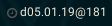

# Script: info-swatchtime

The script prints the system time in Swatch Internet Time. 



## Dependencies

python3

## Module

```ini
[module/info-swatchtime]
type = custom/script
exec = ~/polybar-scripts/swatchtime.py --tail --alt-format " %Y-%m-%dT%H:%M:%S"
tail = True

click-left = kill -s USR1 %pid%
click-right = kill -s USR2 %pid%

format-prefix = 🕓
format-prefix-foreground = #555
```

